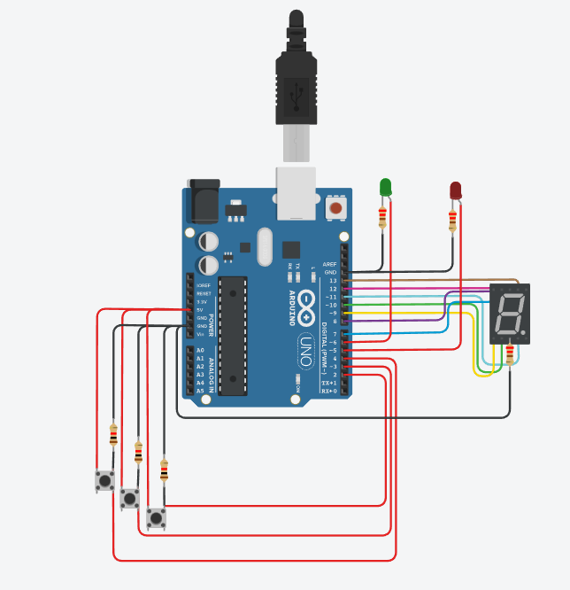

# Parcial (Parte práctica)
--------------------------------------------------------------
## Proyecto: Montacarga

imagen de tinkercad:

### Integrante:
* Josue Damacio

## Descripción
#### Este es un  montacarga funcional como maqueta para un hospital. El objetivo es crear un sistema que pueda recibir ordenes de subir, bajar o pausar desde diferentes pisos y muestre el estado actual del montacargas en el display 7 segmentos.
--------------------------------------------------------------

## Función principal

* ### Varaibles

se definen las varaibles del display 7 segmentos, los leds que indican cuando está en pausa o no, y los 3 botones que se encanrgan de subir un piso, detener el montacarga o bajar y las varaibles que se usarán en el codigo y serán explicadas mas adelante.
~~~
//7 segmentos
#define arriba 13
#define	arriba_derecha 12
#define abajo_derecha 11
#define abajo 10
#define abajo_izquierda 9
#define arriba_izquierda 8
#define centro 7
//leds
#define led_movimiento 6
#define led_detiene 5
//botones
#define boton_sube_uno 4
#define boton_se_detiene 3
#define boton_baja_uno 2
//varaibles de control
int i = 0;
int pausa = LOW;
int estado_anterior_boton = LOW;
int estado_actual_boton = LOW;
~~~
en este ***fragmento*** del "void setup()", hago que los leds sean salidas digitales, también que el botón sea una entrada digital. Luego de esto, uso el "Serial.begin" con una velocidad de transferencia de 9600 para que pueda imprimir texto en el monitor serial. Después invoque ahí mismo una función encargada de mostrar el piso 0 en el siete segmentos una vez iniciada la simulación.
~~~
void setup(){
  pinMode(led_movimiento, OUTPUT);
  pinMode(arriba, OUTPUT);
  pinMode(boton_sube_uno, INPUT);
  Serial.begin(9600);
  iniciar_montacargas_en_0();
}
~~~
--------------------------------------------------------------

* ### Explicación del loop

texto
~~~
codigo
~~~
texto
~~~
codigo
~~~
texto
~~~
codigo
~~~
texto
~~~
codigo
~~~
texto
~~~
codigo
~~~

--------------------------------------------------------------

texto
~~~
codigo
~~~

texto
~~~
codigo
~~~

--------------------------------------------------------------

### Link del proyecto 🙂
- [link_tinkercad](https://www.tinkercad.com/things/3ioYJgqHRUI)