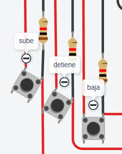

# Parcial (Parte práctica)
--------------------------------------------------------------
## Proyecto: Montacarga

imagen de tinkercad:

### Alumno:
* Josue Damacio

## Descripción
#### Este es un  montacarga funcional como maqueta para un hospital. El objetivo es crear un sistema que pueda recibir ordenes de subir, bajar o pausar desde diferentes pisos y muestre el estado actual del montacargas en el display 7 segmentos.
--------------------------------------------------------------

## Función principal

* ### Varaibles

se definen las varaibles del display 7 segmentos, los leds que indican cuando está en pausa o no, y los 3 botones que se encanrgan de subir un piso, detener el montacarga o bajar y las varaibles que se usarán en el codigo y serán explicadas mas adelante.
~~~
//7 segmentos
#define arriba 13
#define	arriba_derecha 12
#define abajo_derecha 11
#define abajo 10
#define abajo_izquierda 9
#define arriba_izquierda 8
#define centro 7
//leds
#define led_movimiento 6
#define led_detiene 5
//botones
#define boton_sube_uno 4
#define boton_se_detiene 3
#define boton_baja_uno 2
//varaibles de control
int i = 0;
int pausa = LOW;
int estado_anterior_boton = LOW;
int estado_actual_boton = LOW;
~~~
en el "void setup()", hago que los leds sean salidas digitales, también que el botón sea una entrada digital. Luego de esto, uso el "Serial.begin" con una velocidad de transferencia de 9600 para que pueda imprimir texto en el monitor serial. Después invoque ahí mismo una función encargada de mostrar el piso 0 en el siete segmentos una vez iniciada la simulación.
~~~
void setup(){
  pinMode(led_movimiento, OUTPUT);
  pinMode(led_detiene, OUTPUT);
  pinMode(arriba, OUTPUT);
  pinMode(arriba_derecha, OUTPUT);
  pinMode(abajo_derecha, OUTPUT);
  pinMode(abajo, OUTPUT);
  pinMode(abajo_izquierda, OUTPUT);
  pinMode(arriba_izquierda, OUTPUT);
  pinMode(centro, OUTPUT);
  pinMode(boton_sube_uno, INPUT);
  pinMode(boton_se_detiene, INPUT);
  pinMode(boton_baja_uno, INPUT);
  Serial.begin(9600);
  iniciar_montacargas_en_0();
}
~~~
--------------------------------------------------------------

## Loop del montacarga:

~~~
void loop(){
  int estado_actual_boton = digitalRead(boton_se_detiene);

  if (estado_actual_boton != estado_anterior_boton){
    if (estado_actual_boton == HIGH){
      pausa = !pausa;
      delay(100);
    }
    estado_anterior_boton = estado_actual_boton;
  }
  if (pausa == LOW){
    if (digitalRead(boton_sube_uno) == HIGH){
      i++;
      if (i > 9)
        i = 9;
      piso_montacarga(i);
      delay(100);
    }
    if (digitalRead(boton_baja_uno) == HIGH){
      i--;
      if (i < 0)
        i = 0;
      piso_montacarga(i);
      delay(100);
    }
    digitalWrite(led_movimiento, HIGH);
    digitalWrite(led_detiene, LOW);
  } else {
    digitalWrite(led_movimiento, LOW);
    digitalWrite(led_detiene, HIGH);
  }
}
~~~

 ### Explicación del loop:

En el loop, empiezo haciendo asignando el valor del botón a la varaible "estado_actual_boton" (que se habia inicializado como LOW). y al presionar el boton, como es distinto a su estado anterior entrará al primer if donde el valor de "pausa" cambia a "HIGH"  por lo que el valor "i" se mantiene de la misma manera
~~~
#ESTO ESTA DENTRO DEL VOID LOOP

  int estado_actual_boton = digitalRead(boton_se_detiene);

  if (estado_actual_boton != estado_anterior_boton){
    if (estado_actual_boton == HIGH){
      pausa = !pausa;
      delay(100);
    }
    estado_anterior_boton = estado_actual_boton;
  }
~~~

Pero si en la simulación no se presiona el boton, "pausa" sigue en "LOW" y entonces entran en juego el boton de subir y bajar. Su funcion es que al presionar uno u otro, cambiarán el valor de "i", estos a su vez no pueden superar el limite de 9 ni bajar más pisos que 0. Además, si el botón de pausa está desactivado se prenderá el led verde (led_movimiento), caso contrario se prenderá la roja (led_detiene), pero nunca ambas a la vez
~~~
#ESTO ESTA DENTRO DEL VOID LOOP

  if (pausa == LOW){
    if (digitalRead(boton_sube_uno) == HIGH){
      i++;
      if (i > 9)
        i = 9;
      piso_montacarga(i);
      delay(100);
    }
    if (digitalRead(boton_baja_uno) == HIGH){
      i--;
      if (i < 0)
        i = 0;
      piso_montacarga(i);
      delay(100);
    }
    digitalWrite(led_movimiento, HIGH);
    digitalWrite(led_detiene, LOW);
  } else {
    digitalWrite(led_movimiento, LOW);
    digitalWrite(led_detiene, HIGH);
  }
~~~

Así lucen los botones:

En movimiento (ver led verde):

Pausa (ver led rojo):

----------------------

## Funciones:
 ### Explicación de las funciones generales:
* La primer función "iniciar_montacargas_en_0" hace que el display 7 segmentos tempiece siempre con el valor 0.

* La siguiente función "prende_led" recibe por parametro una varaible que hace referencia a un led que debe encender del display 7 segmentos y formar así un numero.

* Esta función "mostrar_piso" recibe un string y lo muestra por monitor serial.

* "apaga_todos_los_led" es la funcion encargada de apar la totalidad de leds del display 7 segmetnos.

* El funcionamiento de "espera_3_segundos" es autoexplicativo, crea un delay de 3000ms, se usa al cambiar de piso.

~~~
void iniciar_montacargas_en_0(){
  apaga_todos_los_led();
  prende_numero_cero();
  Serial.print("0");
}
void prende_led(int led){  	
  digitalWrite(led, HIGH);
}
void mostrar_piso(String piso){
  Serial.println(piso);
}
void apaga_todos_los_led(){
  digitalWrite(arriba, LOW);
  digitalWrite(arriba_derecha, LOW);
  digitalWrite(arriba_izquierda, LOW);
  digitalWrite(abajo, LOW);
  digitalWrite(abajo_derecha, LOW);
  digitalWrite(abajo_izquierda, LOW);
  digitalWrite(centro, LOW);
}
void espera_3_segundos(){
  delay(3000);
}
~~~

---------

## Pisos de montacarga:
### Funcionamiento display 7 segmetnos:

para cada numero a mostar, prendí los leds que formaran dicho numero e hice una función para cada numero posible del 1 al 9, usando la función previamente mencionada "prende_led()" y pasando por parametro el nombre del corerspondiente a la posición. ejemplos del numero 0, 1 y 2:

~~~
void prende_numero_cero(){
    prende_led(arriba);
    prende_led(arriba_derecha);
    prende_led(abajo_derecha);
    prende_led(abajo);
    prende_led(abajo_izquierda);
    prende_led(arriba_izquierda);
}
void prende_numero_uno(){
    prende_led(arriba_derecha);
    prende_led(abajo_derecha);
}
void prende_numero_dos(){
    prende_led(arriba);
    prende_led(arriba_derecha);
    prende_led(centro);
    prende_led(abajo_izquierda);
    prende_led(abajo);
}
~~~

### Funcionamiento del switch:

Acá se retoma el uso de todas las funciones antes mencionadas. Se evalua el valor de i y en todos los casos hay una espera de 3 segundos, también se ejecuta la funcion de apagar leds para que no se prendan leds no deseados al subir o bajar pisos. Luego se prende el numero del piso actual en el siplay 7 segmentos y taambién se imprime el numero de piso en el monitor serial

~~~
void piso_montacarga(int i){
    switch (i)
    { 
    case 0:
      	espera_3_segundos();
      	apaga_todos_los_led();
        prende_numero_cero();
        Serial.print("0");
        break;
    case 1:
      	espera_3_segundos();
        apaga_todos_los_led();
        prende_numero_uno();
        Serial.print("1");
        break;
    case 2:
      	espera_3_segundos();
        apaga_todos_los_led();
        prende_numero_dos();
        Serial.print("2");
        break;
    }
}
~~~

--------------------------------------------------------------

--------------------------------------------------------------

### Link del proyecto 🙂
- [link_tinkercad](https://www.tinkercad.com/things/3ioYJgqHRUI)